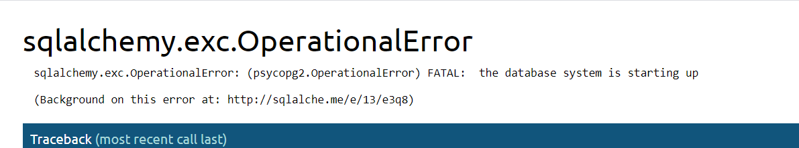

# Bookstore
Mini Aplicação que realiza CRUD de livros, consumidores e vendas. 

## Pré Requisitos
- docker

## Como Rodar
- dentro da pasta backend execute o comando <code>docker-compose build</code>.
- após finalizar o build execute <code>docker-compose up</code>, utilize "-d" para realizar o processo em background.
- execute <code>docker logs -f --tail=100 bookstore-api</code> para ver os logs da aplicação.
- Caso você acesse a aplicação e um erro como o abaixo aparece pode ser que o serviço de banco de dados ainda está subindo, aguarde alguns segundos e acesse novamente.

## Rotas

#### Books

```
    {
        "title": "Animal Farm",
        "author": "George Orwell",
        "unit_price": 12.90
    }
```
POST /books/ -> Cria um novo livro
GET /books/ -> Lista todos os livros
GET /books/1/ -> Recupera um livro pelo id

#### Customers 
```
    {
        "full_name": "Mike Johnson",
        "email": "mike.johnson@mail.com",
        "document_type": "SSN",
        "document_number": 58101365,
        "address": "4444 Nuzum Court, Cheektowaga - New York."
    }
```
POST /customers/ -> Cria um novo consumidor
GET /customers/ -> Lista todos os consumidores
GET /customers/1/ -> Recupera um consumidor pelo id

#### Sales
```
    {
        "customers_id": 1,
        "items": [
            {
                "books_id": 1,
                "quantity": 1
            },
            {
                "books_id": 3,
                "quantity": 1
            },
            {
                "books_id": 5,
                "quantity": 1
            }
        ]
    }
```
POST /sales/ -> Cria uma nova venda
GET /sales/ -> Lista todas vendas
GET /sales/1/ -> Recupera uma venda pelo id